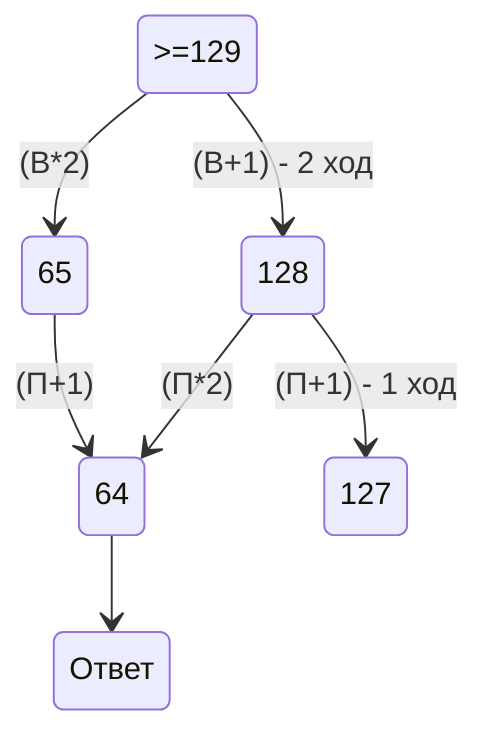
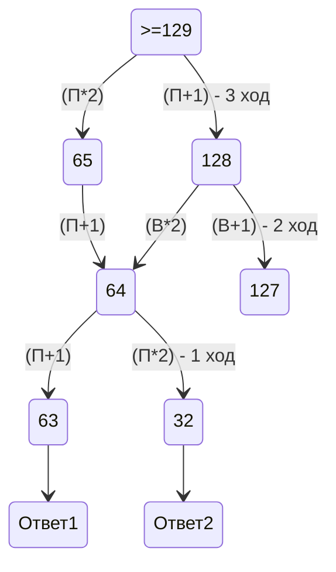
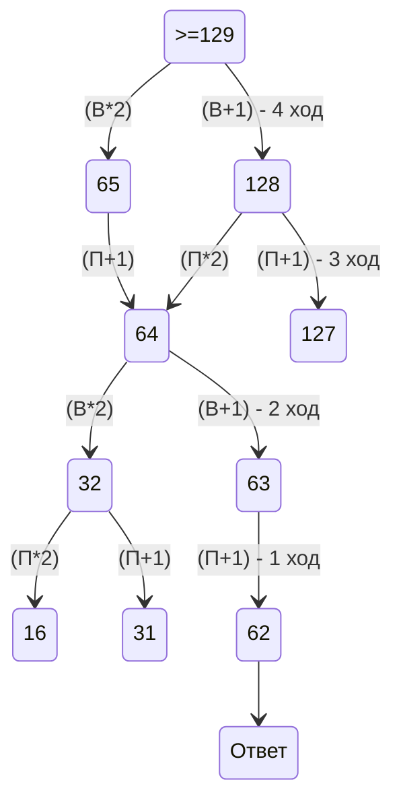

# 1 номер
1) Нарисовать схему и расставить на ней расстояния учитывая сколько путей из 1 точки идёт в другие точки
2) Почситать и сложить длины нужных нам путей

# 2 номер
1) Получить все возможные варианты 4-ёх переменных
2) берем if и выводим x,y,z,w в разном порядке
# 3 номер
1) Создать питон файл и написать код используя for
2) Вывести все возможные варианты

# 4 номер
1) Расписать двоичное дерево
2) Внести в него известные данные
3) Соостнести количество вариантов с количеством символов (начинаем с минимального кода)

# 5 номер
1) Организовать пербор чисел с нуля до того числа которое нужно по условию
2) Перевод числа в двоичную формулу(=bin(i)[2:], =f'{N:b}')
3) Проверка строки по условию и допись с заменой
4) Перевод в десятичную и проверка по уловию с выходом из цикла

# 6 номер
1) Вспомнить команду черепхи
2) Реализовать прорамму задачи
3) Нарисовать точки внутри контура с учётом масштаба
4) Посчитать точки

# 8 номер
1) С помощью for создаём все возможные варианты нужной величины(генерим числа)
2) Проверяем выполняются ли все условия для чисел
3) Создаём ещё одну переменную-счётчик и прибавляем к ней 1 когда условия соблюдены. Выводим счётчик

# 9 номер
1) Записать в питоне
2) разбить на строки

# 10 номер
1) Открыть файл и нажать Ctrl+F установив в параметрах учёт регистра
2) Ввести слово и нажать Enter

# 13 номер
1) Сделать скрин схемы дорог и открыть её в Paint
2) Считать Е за 1 и складывать количество путей на точки в которые мы идём(как в заданиях на ОГЭ по информатике)
3) Посчитать отдельно пути из Е в В и из Е в Л(в других задачах другие буквы) и сложить то что получилось

# 14 номер
1) По возможности преобразовать последовательность в уравнение
2) Организовать подбор параметра для нахождения ответа
3) Обращать внимание на параметр replace 

# 18 номер
1) Открываем файл exel
2) Копируем таблицу которая нам дана и вставляем ниже
3) Просчитываем накопления формулами
4) Нажиманем найти и ищем минимальное значение

# 19 номер
1) Рисуем схему на 4 хода вперёд начиная с победного хода
2) Считаем где чьи ходы(по условию)
3) Находим нужное число(использовать для 19,20 и 21 номеров)

# 20 номер

# 21 номер

# 26 номер
1) Открытие файла в calc или exel и перенести туда файл
2) С помощью фильтра отфильтровать по убыванию
3) =ЕСЛИ(А1-А2=1;1;0)
4) Наложить фильтр отфильтровать по убыванию и наложить 0
5) Считаем разницу между 1 и 2
6) Считаем накопление разницы с условием
7) Считаем все 0

# 27-А номер
1) Загрузить данные из файла и удалить первый элемент
2) Создать переменную по длине списка
3) Нужно удвоить список, чтобы на его основе создать новый рабочий список
4) В цикле мы создаем список на основе среза сдвоенного списка 
5) После создания списка мы обнуляем стоимость
6) Используя созданный список мы считаем для его первого элемента стоимость по формуле
7) Смещая срез мы находим стоимости всех пунктов
8) В случае кольцевой дорогои индексы после середины пересчитываются на убывание (для этого лучше завести новую переменную)
9) К стоимости пунктов накапливаются списки
10) В качестве ответа выдается индекс минимального элемента списка + 1

# 27-B номер
1) В отличие от А мы организуем перебор списка не по длине, а по диапазону в аргументах которого есть шаг, финиш и старт
2) В отличие от 27-А мы используем не перебор, а замен выборочных километров (равнораспределённых)
3) Дополнительно организуем глобальный цикл в котором границы старта и финиша будут изменяться (range)
4) После каждого глобального прохода мы уменьшаем границы дикапозона, уменьшая их
5) Условия выхода из бесконечного цикла это повоторение ответа 2 раза при шаге 1
6) Если шаг равен 0, то шаг устанавливается в 1
7) Целесообразно на каждом проходе писать новые значения старта, финиша и шага
8) Границы диапазона старт и финиш определяются по минимальному километражу - шаг и + шаг соответственно
9) После пересчета старта и финиша мы пересчитываем шаг
10) Целесообразно брать 20 замеров на диапазон
