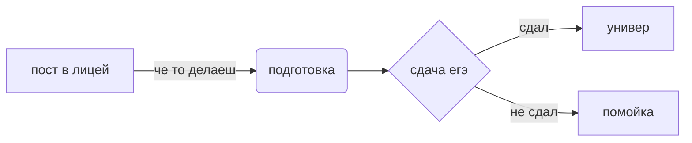

# Пирогов Егор 122б
# азбука морзе.xlsx - перевод кода Морзе
# первый номер.txt - ЕГЭ задание из lictpu/help
# Алгебра логики.xlsx - задание по алгебре логики из lyctpu.github.io
# Книга1.xlsx - задание по алгебре логики из lyctpu.github.io
# Фото нейронки.PNG - скрин нейросимулятора
# задания стр 40, 50.xlsx - задания с 40 и 50 страниц учебника(перевод из разных систем счисления)
# первый номер.txt - ответ на первый номер из демо версии егэ
# ссылка на сайт в wordpress - https://uniyazi.wordpress.com
# bd.py - немного изменённый код с таблицей(SQL файл)
# cod.py - код для решения примеров с 2-мя числами(*,\,+,-)
# turtle - папка с черепахами рисующими деревья
# Смайлик нарисованный в inkscape - смайлик который нарисован в inkscape
# SQL запросы - SQL запросы
# chhihfduifgdihkguhdighgduihoifhgiibohiifojbuif.py - задание на алгебру логики
# cod.py - код для слайд шоу в питоне
# картинка с текстом.py - картинка с наложенным на ней текстом из python
# слайд шоу шаблон.py - шаблон для сайд шоу в питоне
# пример.py - пример слайда со своими картинками(которые там и сгенерированы а не из инета)
# test.mp4 - видео(слайд-шоу)
# викторина для патриотов.py - викторина
# menjatel imen.py - генератор имён(я один сделал(в соло))
# ветка с цветами.svg - ветка в inkscape
# extawords.py - генератор имён, но который сделан с командой
# g.py - универсальный решатель задач
# Код хемминга, морзянка и системы счисления.py-программа вместо хемминга, систем счисления и морзянки(программа-сборник)

$$ \overline{(a \wedge b)} = \overline{a} \vee \overline{b} $$

$$ \overline{\mathrm{E_{1}^{2}}}=\sqrt{\frac{Fa^{x-1}}{(x-1)x}}+\mathrm{a_{1}^{\frac{1}{3}}}+\mathrm{\beta}_{2}^{\frac{2}{3}} $$

$$ a=\frac{{V_{x}^{2}}-{V_{0x}^{2}}}{2S_{x}} $$

$$ S_{x}=V_{0x}t+\frac{{a_{x}}t^{2}}{2} $$

Пути-1
Логичная_логика-2
Фильтруй_это-3
Фано_на_минималках-4
Приписки_и_замены-5
Черепашьи_шаги-6
Вес_музыки-7
Шестерка_в_пятерке-8
Табличное_расследование-9
Секунда_на_поиск-10
Диск_90года-11
По_головам,_или_стремление_вправо-12
Бродяга-аутист-13
Агент_Х-14
Подгонка_правды-15
Разговор_с_самим_собой-16
Пара_избранных-17
Жадный_робот-18
Покерфейс1-19
Покерфейс2-20
Покерфейс3-21
Неречные_потоки-22
Исполнитель_на_траектории-23
Буквы,_стройся-24
Туфелька_на_маскараде-25
Магазин_подарков-26
Глобальные_расчеты_не_терпят_суеты-27

| Задание | Ответ | Решаемо ли без программ |
| ------ | ------ | ------|
| 1 | 58 | да |
| 2 | yxzw | да |
| 3 |355  |  да|
| 4 | 14 |  |
| 5 |  |  |
| 6 |  |  |
| 7 |  |  |
| 8 |  |  |
| 9 | 16 | да |
| 10 | 45 | да |
| 11 |  |  |
| 12 |  |  |
| 13 |  |  |
| 14 |  |  |
| 15 |  |  |
| 16 |  |  |
| 17 |  |  |
| 19 | 64 | да |
| 20 | 32 и 63 | да |
| 21 | 62 | да |
| 22 |  |  |
| 23 |  |  |
| 24 |  |  |
| 25 |  |  |
| 26 |  |  |
| 27 |  |  |

