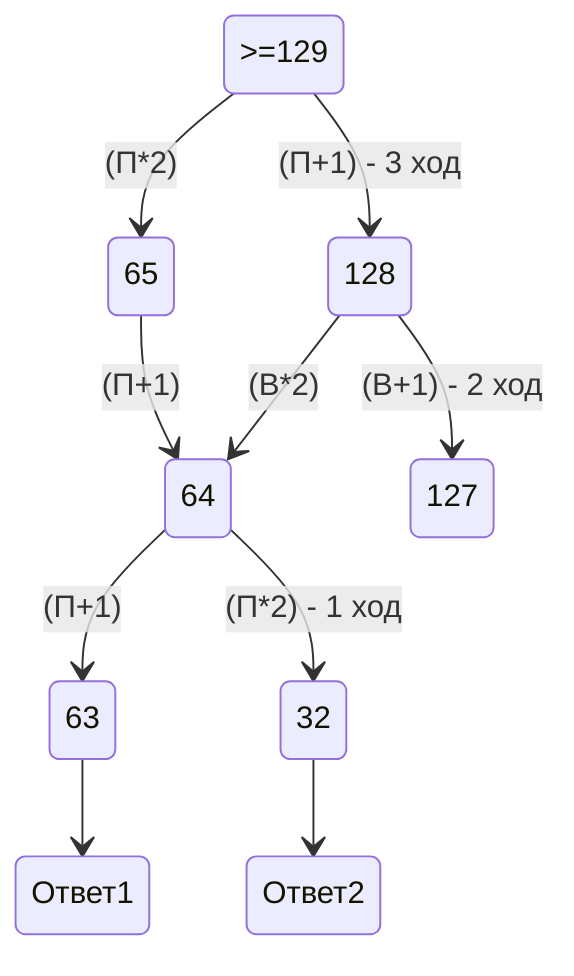
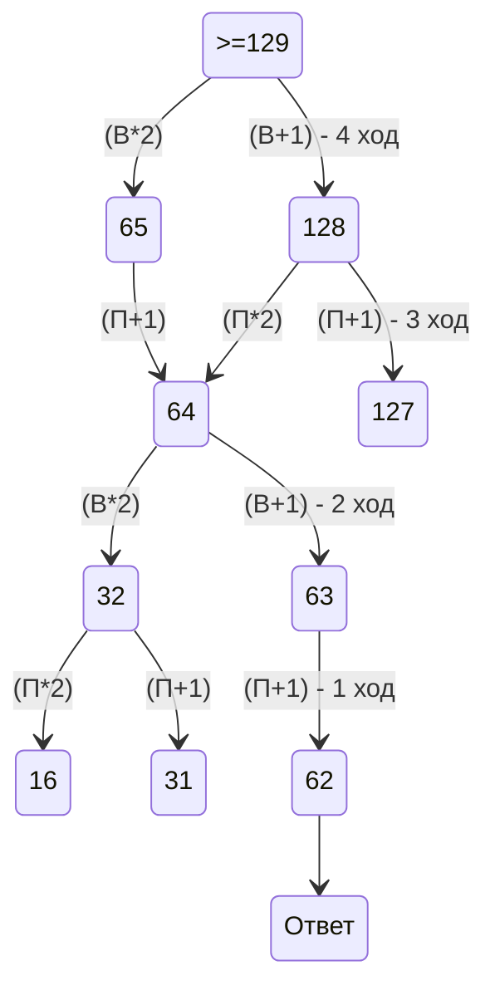

# 1 номер
1) Нарисовать схему и расставить на ней расстояния учитывая сколько путей из 1 точки идёт в другие точки
2) Почситать и сложить длины нужных нам путей

# 10 номер
1) Открыть файл и нажать Ctrl+F установив в параметрах учёт регистра
2) Ввести слово и нажать Enter

# 3 номер
1) Создать питон файл и написать код используя for
2) Вывести все возможные варианты

# 19 номер

# 20 номер

# 21 номер

