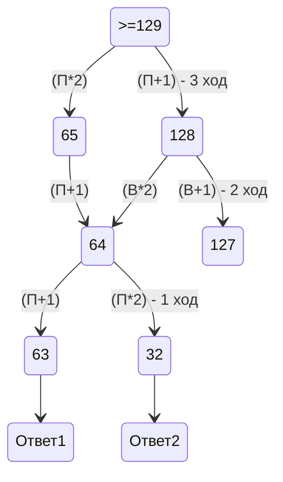
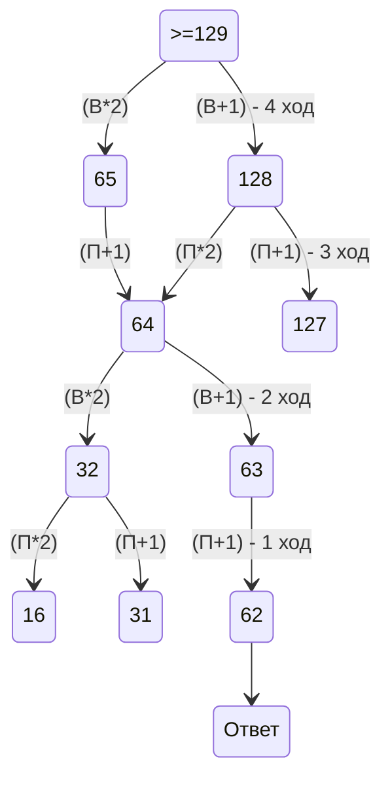

# 1 номер
1) Нарисовать схему и расставить на ней расстояния учитывая сколько путей из 1 точки идёт в другие точки
2) Почситать и сложить длины нужных нам путей

# 3 номер
1) Создать питон файл и написать код используя for
2) Вывести все возможные варианты

# 4 номер
1) Расписать двоичное дерево
2) Внести в него известные данные
3) Соостнести количество вариантов с количеством символов (начинаем с минимального кода)
# 9 номер
1) Записать в питоне
2) разбить на строки

# 10 номер
1) Открыть файл и нажать Ctrl+F установив в параметрах учёт регистра
2) Ввести слово и нажать Enter
# 13 номер
1) Сделать скрин схемы дорог и открыть её в Paint
2) Считать Е за 1 и продолжить считать как в задании №1
3) Посчитать отдельно пути из Е в В и из Е в Л
# 19 номер
1) Рисуем схему на 4 хода вперёд начиная с победного хода
2) Считаем где чьи ходы(по условию)
3) Находим нужное число(использовать для 19,20 и 21 номеров)

# 20 номер

# 21 номер

